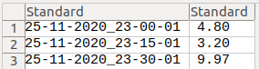
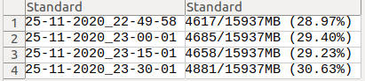

# Centos Health Tracker

Centos Health Tracker is a shell script to keep track of CPU, memory usage and the available space on the disk. The script saves the device usage on three separates `csv` files. The tracker is updated every `15 minutes`. This project is designed for a centOS machine, We used ec2 AMI `CentOS 7(x86_64)-with Updates HVM`.
To make fast and efficient deployment I used Ansible playbook to perform the following tasks:

- Deploy the shell script.
- Create The directory and the files on `/opt/usage` directory.
- A crone task to run the script for every 15 minutes.
- Install nano editor and MySQL server as they are essential for each server.
- Install java OpenJDK 11 using roles for future implementation.

Thougth this repository we are going to share the detailed implementation and the output for reusing and learning purpose,

- [Write Script To Keep Track Of Machine Health](#Write-Script-To-Keep-Track-Of-Device-Health)
  - [Timestamp](#Timestamp)
  - [CPU Usage](#CPU-Usage)
  - [Free Memory Percentage](#Free-Memory-Percentage)
  - [DISK Availble Percentage](#DISK-Availble-Percentage)
  - [Save Machine Health To CSV Files](#Save-Machine-Health-To-CSV-Files)
    - [awk Command](#awk-Command)
    - [CSV files](#csv-files)
  - [The Machine Health Script](#The-Machine-Health-Script)
- [Ansible playbook deployment](#heading-1)
  - [Create directory and files](#Create-directory-and-files)
  - [Machine Health Script Deployment](#Machine-Health-Script-Deployment)
  - [Add Cron Task](#Add-Cron-Task)
  - [Install some packages by passing them as parameter](#Install-some-packages-by-passing-them-as-parameter)
  - [Install Java Openjdk 11 using Roles](#Install-Java-Openjdk-11-using-Roles)
- [See Output Examples](#See-Output-Examples)
- [Reuse The Project](#Reuse-The-Project)
- [Possible Issues](#Possible-Issues)

## Write Script To Keep Track Of Device Health

### Timestamp

First, We are going to get the timestamp using `$(date)` variable

```
ر نوف 25 08:34:06 EET 2020
```

To make the current time easier to read, I will use the European standard `$(date +%d-%m-%Y_%H-%M-%S)`

```
25-11-2020_08-36-04
```

### CPU Usage

`top` command to get the CPU usage load average

```
top -bn1 | grep load
```

### Free Memory Percentage

`free` command to get the available memory in megabytes

```
free -m
```

### DISK Available Percentage

`df` command to display available space in all file systems

```
df -h
```

### Save Machine Health To CSV Files

First, we need to import files. The files will be created using ansible-playbook on the deployment section.

```
CPU=/opt/usage/CPU.csv
MEM=/opt/usage/MEM.csv
DISK=/opt/usage/DISK.csv
```

To print commands specific output and the percentages we are going to use `awk` command to customize our output.

#### awk Command

The awk command will be used for gathering data and manipulate commands output for the three above commands. The commands will be:

```
top -bn1 | grep load | awk '{printf "%.2f\n", $(NF-2)}'
free -m | awk 'NR==2{printf "%s/%sMB (%.2f%%)\n", $3,$2,$3*100/$2 }'
df -h | awk '$NF=="/"{printf "%d/%dGB (%s)\n", $3,$2,$5}'
```

NR is for the number of records in the input file.
NF is for the number of fields in the current record.
Now, we need to add the output of these commands on the above files then add the timestamp on separate columns.

### CSV files

To create the columns on `csv` file we need only to add `,` to our string and use `>>` to append output to the script

```
top -bn1 | grep load | awk '{printf "'$timestamp', %.2f\n", $(NF-2)}'>>$CPU
free -m | awk 'NR==2{printf "'$timestamp',%s/%sMB (%.2f%%)\n", $3,$2,$3*100/$2 }'>>$MEM
df -h | awk '$NF=="/"{printf "'$timestamp', %d/%dGB (%s)\n", $3,$2,$5}'>>$DISK
```

### The Machine Health Script

Now the script should be something like that

```
#!/bin/sh

# get the three output .csv files
CPU=/opt/usage/CPU.csv
MEM=/opt/usage/MEM.csv
DISK=/opt/usage/DISK.csv

# timestamp with european standard day-month-year_hours_minute_second
timestamp=$(date +%d-%m-%Y_%H-%M-%S)
top -bn1 | grep load | awk '{printf "'$timestamp', %.2f\n", $(NF-2)}'>>$CPU
free -m | awk 'NR==2{printf "'$timestamp',%s/%sMB (%.2f%%)\n", $3,$2,$3*100/$2 }'>>$MEM
df -h | awk '$NF=="/"{printf "'$timestamp', %d/%dGB (%s)\n", $3,$2,$5}'>>$DISK

```

## Ansible playbook deployment

To make my centOS AMI machine-accessible by `ansible-playbook` I will have to add the IP address and `.pem` private key file inside the `hosts` file.

```
nano /etc/ansible/hosts
```

To make the instance credential more reusable and easier to use. I will create a var name `centos` with the IP address and the private key file.

```
[centos]
54.196.56.35
[centos:vars]
ansible_user=centos
ansible_ssh_private_key_file=/etc/ansible/checkUsageMachine.pem
```

Now the ansible-playbook should gain access to the deployed instance. Some operations will need route access so I will use `became:yes`.

```
---
- name: Deploy the tracker usage tracker
  hosts: centos
  became:yes
```

### Create directory and files

First tasks is to create `/opt/usage` directory and three `csv` files inside it.

- Creating directory task.
  To make files more accessible I will set read&write permission to everyone `mode:"777"` and use `recursive:yes` to make sure that all created files have the same permission.

```
- name: create usage directory inside /opt
      file:
        path: /opt/usage
        state: directory
        owner: root
        mode: "777"
        recurse: yes
```

- Create three .csv files inside `/opt/usage` directory.

```
- name: create CPU.csv file inside /opt/usage
  file:
    path: /opt/usage/CPU.csv
    mode: "777"
    state: touch
- name: create MEM.csv file inside /opt/usage
  file:
    path: /opt/usage/MEM.csv
    mode: "777"
    state: touch
- name: create DISK.csv file inside /opt/usage
  file:
    path: /opt/usage/DISK.csv
    mode: "777"
    state: touch
```

### Machine Health Script Deployment

The script name `machineHealth.sh` will be copied from my local machine to the AWS deployed machine. Add `a+x` mode to make the script executable

```
- name: Deploy script file
    copy:
      src: ./machineHealth.sh
      dest: /home/centos/machineHealth.sh
      mode: a+x
```

### Add Cron Task

To run the script every 15 minutes.

```
  - name: Create a crone job to analysis the system each 15 minutes
    cron:
      name: "run tracker"
      minute: "15"
      job: "/home/centos/machineHealth.sh"
```

### Install some packages by passing them as a parameter

```
 - name: Install some linux packages passed as a parameter
      yum:
        name:
          - nano
          - mysql
        state: present
```

### Install Java OpenJDK 11 using Roles

Roles are a ready-made set of tasks. So it would be cleaner to create it on a separate `YAML`

```
touch installJava.yaml
```

The roles will be installed from `lean_delivery.java`

```
ansible-galaxy install lean_delivery.java
```

Add role to `installJava.yaml` file

```
---
- name: Install OpenJDK java
  hosts: centos

  roles:
    - role: lean_delivery.java
      java_major_version: 11
      java_tarball_install: true
      transport: web
      transport_web: https://download.java.net/java/GA/jdk11/9/GPL/openjdk-11.0.2_linux-x64_bin.tar.gz
```

To install java OpenJDK in more different ways you can check lean_deivery official [repository](https://github.com/lean-delivery/ansible-role-java).

## See Output Examples

You can found screenshots from the three .csv files:

- [CPU.csv](./Outputs/CPU_1.png)
- [MEM.csv](./Outputs/MEM_1.png)
- [DISK.csv](./Outputs/DISK_1.png)

As I didn't make a lot of changes on the deployed machine. Its a micro type, So you will observer a small variation between values every 15 minutes.
I implemented the same script on my personal Ubuntu machine. I got variations more than a micro instance with 8GB storage and 1GB of memory.

- CPU.csv

  

- MEM.csv

  

## Reuse The Project

You can find all script and playbook examples here:

- [machineHealth script](machineHealth.sh)
- [ansible-playbook](playbook.yml)
- [installJava role](installJava.yml)

## Possible Issues

- For learning purposes, AWS free tier could be the best option for you as they are totally for free. check their [centos IAM](https://aws.amazon.com/marketplace/pp/Centosorg-CentOS-7-x8664-with-Updates-HVM/B00O7WM7QW)

- For the following warnings

  ```
  [WARNING]: Unable to parse /etc/ansible/hosts as an inventory source
  [WARNING]: No inventory was parsed, only implicit localhost is available
  [WARNING]: provided hosts list is empty, only localhost is available. Note that
  the implicit localhost does not match 'all'
  ```

  Change `etc/ansible/hosts` peremssion to 744.

  ```
  sudo chmod 744 /etc/ansible/hosts

  ```

- check all hosts have been registered using `ansible all --list-hosts`
- For creating files and directory tasks don't forget to path `mode` value as a string otherwise it's not going to work

  ```
  mode:"777" # not 777 with quotes
  ```

- For crone tasks, the ansible may add the crone task like that

  ```
  15 * * * * /home/centos/systemUtilization.sh
  ```

  In the above case, you will need to add `*/` before the minutes

  ```
  */15 * * * * /home/centos/systemUtilization.sh
  ```
